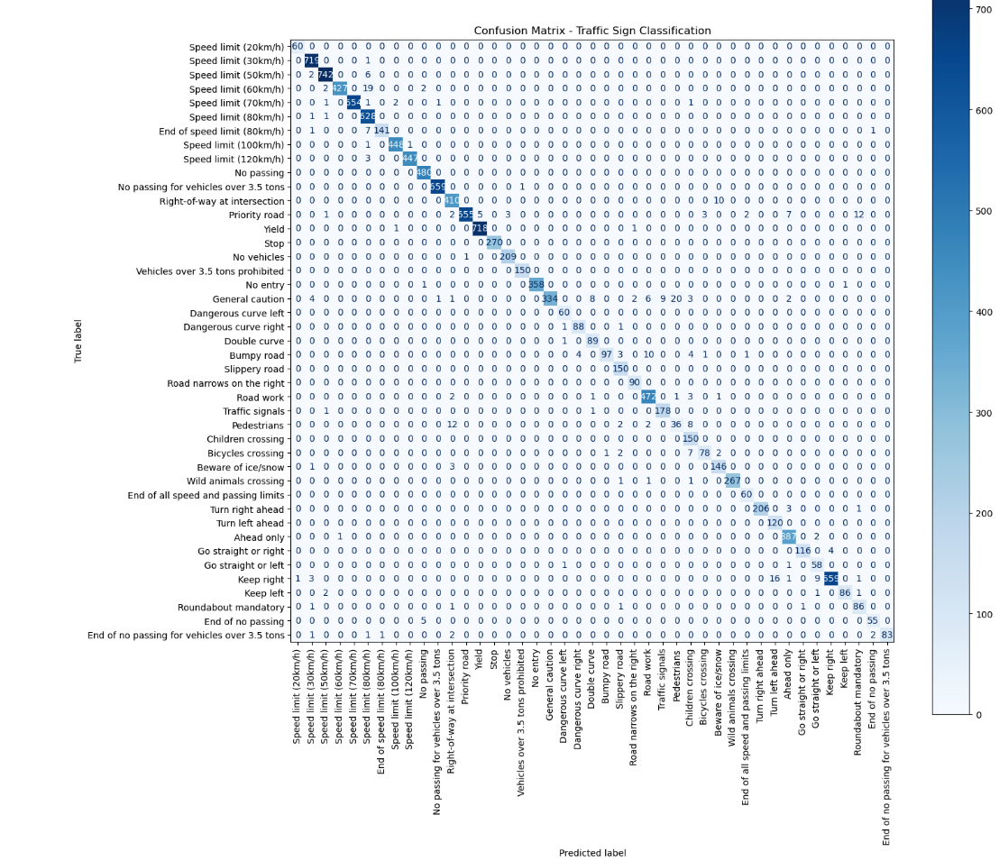
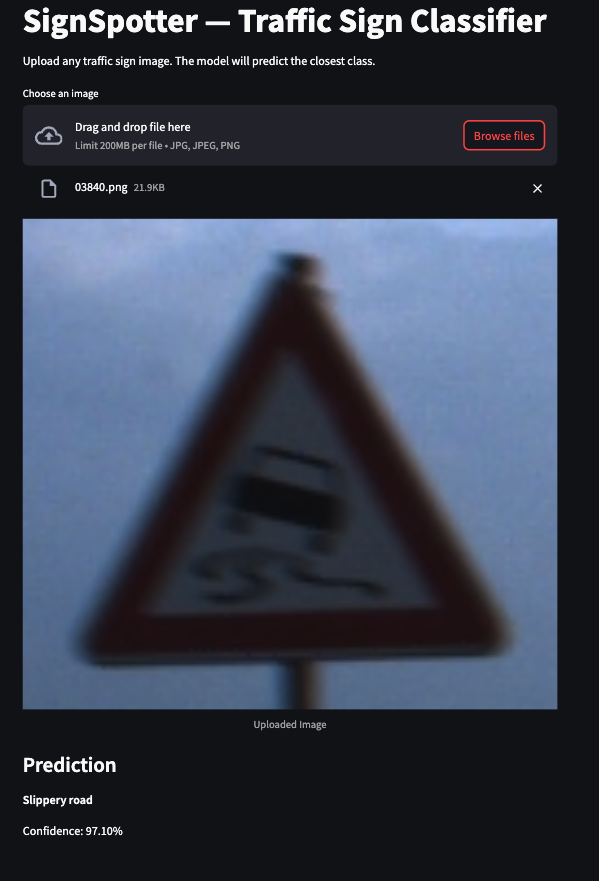

**SignSpotter - Traffic Sign Classification**

This project focuses on detecting and classifying traffic signs using a convolutional neural network built on top of MobileNetV2.
The goal is to build an end-to-end system that loads the dataset, trains a robust model with augmentation, evaluates performance, and provides an easy-to-use Streamlit interface for real-time prediction.

The project uses the German Traffic Sign Recognition Benchmark (GTSRB) format, including bounding box metadata, but the final classifier works directly on full images (no ROI required for inference).


## **Project Overview**

The work includes:

* Preparing and cleaning the dataset
* Filtering invalid image paths
* Applying data augmentation to improve generalization
* Splitting the dataset into train, validation, and test sets
* Training a MobileNetV2-based classifier
* Tracking training and validation performance
* Evaluating the model on the test set using accuracy, classification report, and confusion matrix
* Deploying a simple Streamlit app that performs real-time traffic sign prediction

The final trained model is saved and reused for inference inside the app.

**Model Architecture**

The project uses **MobileNetV2 (pretrained on ImageNet)**, modified to output 43 traffic sign classes.

Reasons for choosing MobileNetV2:

* lightweight
* fast on CPU and M1/MPS
* strong transfer learning performance
* works well with limited data


**Folder Structure**

```
SignSpotter/
│
├── app.py                     # Streamlit app for predictions
├── requirements.txt           
├── README.md
│
├── models/
│   └── best_signspotter_model.pth
│
├── data/
│   └── Train_filtered.csv
│   └── Test_filtered.csv
│   └── Train_split.csv
│   └── Val_split.csv
│   └── Train.csv
│   └── Test.csv
│   └── meta.csv
│
├── notebooks/
│   └── signspotter.ipynb      # Development notebook
│
├── src/
│   ├── data_loader.py         # Dataset, transforms, loaders
│   ├── model.py               # MobileNetV2 model definition
│   ├── train.py               # Training loop
│   ├── evaluate.py            # Evaluation utilities
│   └── utils.py               # Small helper functions
├── results/
```

**Training Details**

The model was trained using:

* MobileNetV2 backbone
* Adam optimizer
* CrossEntropyLoss
* Image augmentation (rotation, affine transforms, color jitter)
* 64×64 input resolution
* Early stopping by saving the best validation accuracy

During training, losses and accuracies for both train and validation sets were recorded and plotted to monitor learning behavior.

**Results**

After training, the final model achieved:

1. **test accuracy**: 83.26%)
2. Clear classification boundaries in the confusion matrix


3. Good generalization performance due to augmentation


The classification report and confusion matrix provide detailed insights into per-class performance.

**Running the Streamlit App**

To launch the prediction interface:

```bash
streamlit run app.py
```

Upload any traffic sign image, and the model will output:

* Predicted class
* Human-readable label
* Confidence score




The model automatically handles preprocessing and normalization.

**Dependencies**

Install required packages using:

```bash
pip install -r requirements.txt
```

**Future Improvements**

* Add ROI-based detection before classification
* Improve UI with probability visualizations
* Deploy the app publicly on Streamlit Cloud
* Convert the model to ONNX or TensorRT for portability

